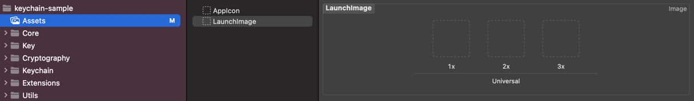

# screen_protector

Safe Data Leakage via Application Background Screenshot and Prevent Screenshot for Android and iOS.

## Feature

### iOS

#### Protect Data Leakage Background Screenshot

- Protect data leakage with image

```dart
await ScreenProtector.protectDataLeakageWithImage('LaunchImage');
```

- Protect data leakage with color

```dart
await ScreenProtector.protectDataLeakageWithColor(Colors.white);
```

- Protect data leakage with blur

```dart
await ScreenProtector.protectDataLeakageWithBlur();
```

#### Prevent Screenshot

- ON

```dart
await ScreenProtector.preventScreenshotOn();
```

- OFF

```dart
await ScreenProtector.preventScreenshotOff();
```

#### Check Screen Recording

```dart
final isRecording = await ScreenProtector.isRecording();
```

### Android

#### Protect Data Leakage Background Screenshot and Prevent Screenshot 

- ON

```dart
await ScreenProtector.protectDataLeakageOn();
```

or

```dart
await ScreenProtector.preventScreenshotOn();
```

- OFF

```dart
await ScreenProtector.protectDataLeakageOff();
```

or

```dart
await ScreenProtector.preventScreenshotOff();
```

#### Protect Data Leakage for Android 12+

[https://github.com/prongbang/screen-protector](https://github.com/prongbang/screen-protector)

```kotlin
import com.prongbang.screenprotect.AndroidScreenProtector

class MainActivity : FlutterFragmentActivity() {

    private val screenProtector by lazy { AndroidScreenProtector.newInstance(this) }

    // For Android 12+
    override fun onWindowFocusChanged(hasFocus: Boolean) {
        super.onWindowFocusChanged(hasFocus)
        screenProtector.process(hasFocus.not())
    }
}
```

## Usage

### Android

- Protect Data Leakage Background Screenshot and Prevent Screenshot.

```dart
class _PreventScreenshotPageState extends State<MyApp> {
  
  @override
  void initState() async {
    await ScreenProtector.protectDataLeakageOn();
    super.initState();
  }

  @override
  void dispose() async {
    await ScreenProtector.protectDataLeakageOff();
    super.dispose();
  }
  
}
```

### iOS

- Prevent Screenshot

```dart
class _PreventScreenshotPageState extends State<MyApp> {
  
  @override
  void initState() async {
    await ScreenProtector.preventScreenshotOn();
    super.initState();
  }

  @override
  void dispose() async {
    await ScreenProtector.preventScreenshotOff();
    super.dispose();
  }
  
}
```

- Protect data leakage with color

```dart
class _ProtectDataLeakagePageState extends State<MyApp> {
  
  @override
  void initState() async {
    await ScreenProtector.protectDataLeakageWithColor(Colors.white);
    super.initState();
  }
  
}
```

- Protect data leakage with image



```dart
class _ProtectDataLeakagePageState extends State<MyApp> {
  
  @override
  void initState() async {
    await ScreenProtector.protectDataLeakageWithImage('LaunchImage');
    super.initState();
  }
  
}
```

- Protect data leakage with blur

```dart
class _ProtectDataLeakagePageState extends State<MyApp> {
  
  @override
  void initState() async {
    await ScreenProtector.protectDataLeakageWithBlur();
    super.initState();
  }
  
}
```
